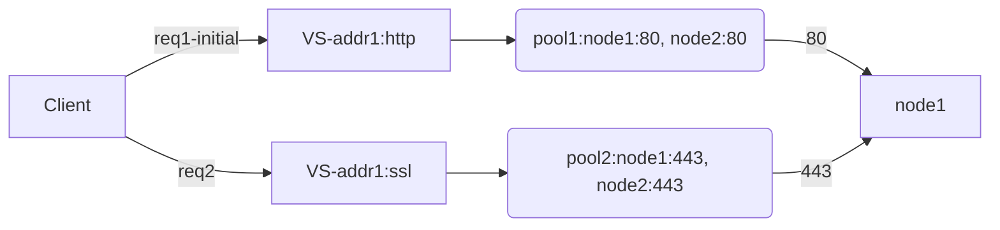
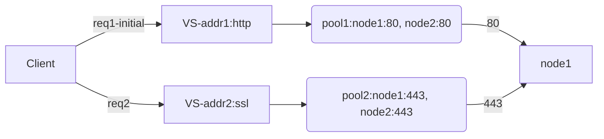
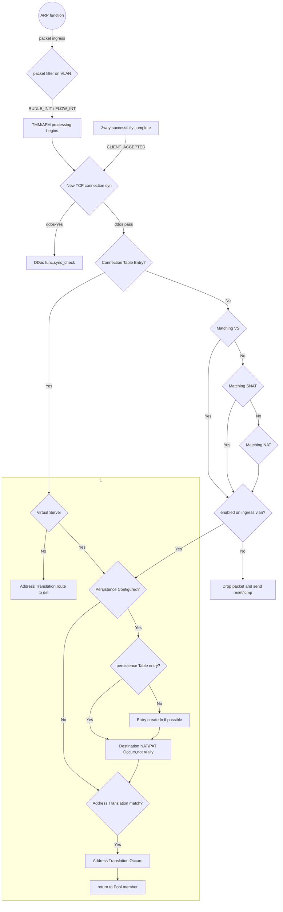
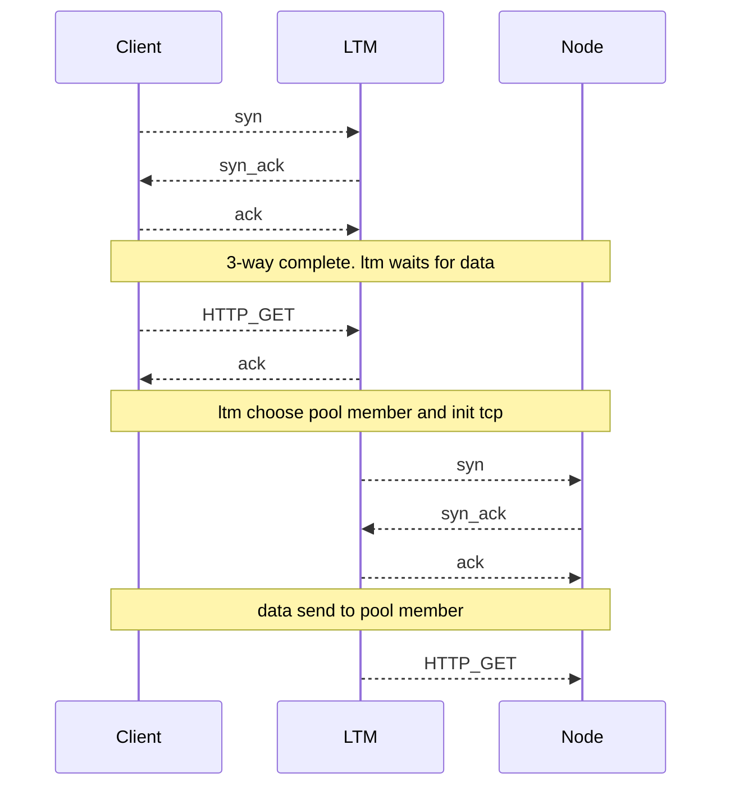
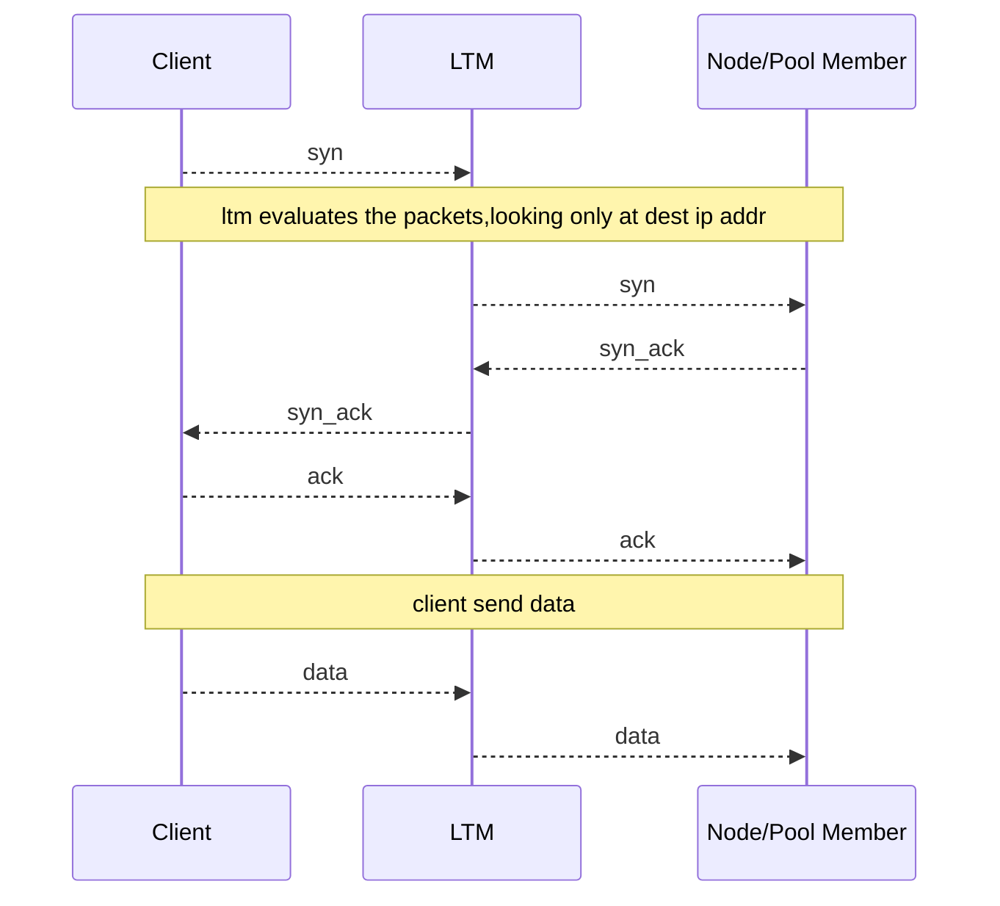

### About
F5 Certified! Technology Specialist, Local Traffic Manager (F5-CTS, LTM)

> v2017 by Edward

> current exam based on version v11.5

> To see the table in this docment please refer to [mermaid](https://mermaidjs.github.io/flowchart.html),recommand editor tool: vs code with mermaid pulgin.

> To support flowchart on http://note.youdao.com ,remove "mermaid"(China Only)

##### Reading List
- BIG-IP® Local Traffic Manager™: Concepts //pdf
- Certification Study Guide 301b //pdf
- BIG-IP_Local_Traffic_Manager__Implementations //pdf

# Contents

#### Section1:Troubleshoot basic virtual server connectivity issues
#### Section2: Identify and resolve application issues
#### Section3: Identify and resolve LTM device issues
#### Section4 Q&A


# Section1:Troubleshoot basic virtual server connectivity issues

> Stream profile: 

    -with HTTP profile    ---> search and replace only on HTTP payload
    -without HTTP profile ---> search and replace on tcp payload
    
> TCP window & buffer:
    
    -max-non-scaled window = 64k
    -proxy buffer high = 131072 (lan-opt:low=98,304 wan-opt:low=131,072)
    
> OneConnect & HTTP:
    
    - SOL6997 / SOL5911 / SOL7208
    -works with keep-alive enabled by default in HTTP/1.1
    -without OneConnect: LB once per tcp connection
    -with OC http/non-http-tcp: ltm is able to proc each request
    -source maskes
    -If SNAT is configured, the BIG-IP system performs SNAT address translation on the source IP address, 
    and then applies the OneConnect source mask to the translated SNAT IP address to determine whether it is eligible to reuse an existing idle connection.
    
> Deferred Accecpt Tcp profile:
    
    -option specifies that the system does not dedicate resources to the connection until the system has received the data packet from the client.
    This setting is useful when negotiating 3-way handshake denial-of-service attacks.
    -disabled by default.
    -not compatible with virtual servers (such as FTP, POP3, and SMTP) for applications that either require *dialog or present a banner*. 
    


## Objective: Upgrade and recovery

> Explain how to upgrade a vCMP environment
    
    -vCMP guest states
        *configured: not runnig,no resource, de-allocate cpu and memery
        *provisioned: allocate resource,create virtual disk
        *deployed: install,run, immediately propagate: hostname,cluster ip, allowed vlans
    
    -dirs:
        /shared/images

> Install sw

    -tmsh install sys software image [image name] volume [volume name]
    -or from web

> *A Sync-Failover device group can support a maximum of 15 traffic groups.*

> SCF and UCS files
```
-dir: /var/local/scf,/var/local/ucs
-Beginning in BIG-IP 11.0.0, when installing a UCS configuration archive, the BIG-IP system restores the full configuration.
-ucs: usrname/passwd,ssl private keys,critical sys files
-tmsh [load | save] /sys ucs <filename> [no-license | no-private-key]
    //on 6400/8400/8800: run /util bash ; keyswap.sh sccp;exit;reboot
-0107102b:3: Master Key decrypt failure - decrypt failure - final

```

## Objective: Alert
    
> Enterprise Manager:

    -an appliance that helps you streamline the administrative tasks associated with managing multiple network devices.
    -tasks include: performance monitoring, software installation and upgrades, configuration archival and restoration, certificate monitoring, security policy management, software image storage, and user account management.
    -em local&remote events:...
    
    -Enterprise Manager allows administrators to establish baseline application usage 
     and generate an alert if an administratively set threshold for the application is exceeded


> AVR Alerting:

> Remote syslogging:

    creating a pool of servers, 
    creating a custom request logging profile that determines log content and references the log server pool, 
    and then assigning the profile to each virtual server that you create to process application traffic.

>Alert configuration files:
    
    -pre-configured snmp traps: /etc/alertd/alert.conf
    -user-defined SNMP traps: /config/user_alert.conf
    
>log test:
    
    logger -p <facility>.<level> “<alert code>:<log level>: “<Syslog Message String>”
    din we cam


| Log level | Description                      | Corresponding syslog level |
| --------- | -------------------------------- | -------------------------- |
| 0         | System is unusable               | emerg                      |
| 1         | Action must be taken immediately | alert                      |
| 2         | Critical Conditions              | crit                       |
| 3         | Error Conditions                 | err                        |
| 4         | Warning Conditions               | warning                    |
| 5         | Normal but significant condition | notice                     |
| 6         | Informational                    | info                       |
| 7         | Debug-level messages             | debug                      |


# Section2: Identify and resolve application issues

## Objective: iRule

- [ ] [Wiki: iRules API](https://devcentral.f5.com/wiki/iRules.BasicRuleElements.ashx)

> irule events

```
# http events
HTTP_CLASS_FAILED - Triggered when an HTTP request is made to a virtual server with at least one HTTP class configured. and the request does not match the filters of any HTTP class.
HTTP_CLASS_SELECTED - Triggered when an HTTP request matches an HTTP class.
HTTP_DISABLED - triggered when HTTP is disabled
HTTP_PROXY_CONNECT - triggered when proxy chaining via use of the HTTP_PROXY_CONNECT profile
HTTP_PROXY_REQUEST - Triggered when a virtual server has proxy-mode explicit
HTTP_PROXY_RESPONSE - triggered when the response from the remote HTTP proxy is received
HTTP_REJECT - triggered when HTTP aborts the connection
HTTP_REQUEST - Triggered when the system fully parses the complete client HTTP request headers.
HTTP_REQUEST_DATA - Triggered when an HTTP::collect command has collected the specified amount of request data.
HTTP_REQUEST_SEND - Triggered immediately before an HTTP request is sent to the server-side TCP stack.
HTTP_RESPONSE - Triggered when the system parses all of the response status and header lines from the server response.
HTTP_RESPONSE_CONTINUE - Triggered whenever the system receives a 100 Continue response from the server.
HTTP_RESPONSE_DATA - Triggered when an HTTP::collect command has collected the specified amount of response data.
HTTP_REQUEST_RELEASE - Triggered when the system is about to release HTTP data on the serverside of the connection.
HTTP_RESPONSE_RELEASE - Triggered when the system is about to release HTTP data on the clientside of the connection.

#ip events
CLIENT_ACCEPTED - Triggered when a client has established a connection.
CLIENT_CLOSED - This event is fired at the end of any client connection. regardless of protocol.
CLIENT_DATA - Triggered each time new data is received from the client while the connection is in “collect” state.
CLIENTSSL_DATA - Triggered each time new SSL data is received from the client while the connection is in “collect” state.
SERVER_CLOSED - This event is triggered when the server side connection closes.
SERVER_CONNECTED - Triggered when a connection has been established with the target node.
SERVER_DATA - Triggered when new data is received from the target node after TCP::collect command has been issued.
SERVERSSL_DATA - Triggered when new SSL data is received from the target node after SSL::collect command has been issued.

#tcp events (ip events included)
USER_REQUEST - triggered by command TCP::notify request.
USER_RESPONSE - Triggered by command TCP::notify response


```

> The syntax for the log is:

    -log [<facility>.<level>] <message>
    -facility: “local0”, “local1”, “local2”, “local3”, “local4”, “local5”, “local6”, “local7”
    -level: “alert”, “crit”, “debug”, “emerg”, “err”, “error”, “info”, “none”, “notice”,“panic”, “warn”, “warning”
    -default: “local0” and “error” (local0.)

> AVR:
    
    -avr to trace app traffic
    -create a Analytics profile for vs/app
    
> Browser requirements to obtain page load times

    -Supports Navigation Timing by W3C
    -Accepts cookies from visited application sites
    -Enables JavaScript for the visited application sites

## Objective: HTTP/HTTPS

> Response Code

    1xx: Informational - Request received, continuing process
    
    2xx: Success - The action was successfully received, understood, and accepted
    
    3xx: Redirection - Further action must be taken in order to complete the request
    
    4xx: Client Error - The request contains bad syntax or cannot be fulfilled
    
    5xx: Server Error - The server failed to fulfill an apparently valid request

> HTTP Method
    
    GET / HEAD / POST / TRACE / PUT / DELETE HEAD

> HTTP HEADERS

    1. HTTP version (HTTP/1.0 or HTTP/1.1)
    
    2. Accept-Encoding: gzip, deflate (not include in 1.0 by default)
    
    3. Connection: Keep-Alive (not include in 1.0 by default)
    
    4. If-* headers
    
    5. Cache-Control or Pragma no-cache


```
GET /home.html HTTP/1.1
Host: example1.org

If the URL references a port other than the default (TCP port 80), this is also given in the Host header.
Clearly, since HTTP/1.0 clients will not send Host headers, HTTP/1.1 servers cannot simply reject all
messages without them. However, the HTTP/1.1 specification requires that an HTTP/1.1 server must reject
any HTTP/1.1 message that does not contain a Host header.
```

> ssldump utility

[packet trace with ssldump](https://support.f5.com/csp/article/K10209)

```
//To create a pre-master secret key log file, use the following ssldump syntax:

ssldump -r /path/to/capture_file -k /path/to/private_key -M /path/to/premaster-
key_log_file

//For example, the following ssldump command reads the www-ssl-client1.cap capture file using the test. org key file to decrypt the session, and creates the PMS log file called client1.pms:

ssldump -r /var/tmp/www-ssl-client1.cap -k /config/filestore/files_d/Common_d/
certificate_key_d/\:Common\:test.org.key_1 -M /var/tmp/client1.pms


To print the decrypted application data, 
use the -k option to specify the path and name of the file
containing the server’s private key.

For example:
ssldump -Aed -nr /var/tmp/www-ssl-client.cap -k /config/ssl/ssl.key/www-ssl.key

Note: In BIG-IP 11.x, the SSL profile keys are stored in the /config/filestore/files_d/<partition_name>_d/certificate_key_d/ directory.


-n Do not resolve host names.
-A Print all fields (ssldump, by default, prints only the most interesting).
-e Print absolute timestamps.
-d Display application data, including traffic before session initiates.
-M Output a pre-master secret log file (v. 11.2.0 and later)


ssldump example:

ssldump -nr /var/tmp/www-ssl-client.cap

The SSL records printed by the ssldump utility appear similar to the following example:

New TCP connection #2: 172.16.31.22(32866) <-> 192.168.1.8(8389)
2 1 0.0002 (0.0002) C>S Handshake
ClientHello                     //c->s clientHello
Version 3.0
resume [32]=
a3 ca ad 46 95 5d 64 bb 33 ec b5 12 91 21 a3 50
d2 c0 c5 f6 67 c3 cc 9e c0 4a 71 1b 92 dc 58 55
cipher suites
SSL_DHE_RSA_WITH_AES_256_CBC_SHA
SSL_DHE_DSS_WITH_AES_256_CBC_SHA
SSL_RSA_WITH_AES_256_CBC_SHA
SSL_DHE_RSA_WITH_AES_128_CBC_SHA
SSL_DHE_DSS_WITH_AES_128_CBC_SHA
SSL_RSA_WITH_RC4_128_MD5
SSL_RSA_WITH_RC4_128_SHA
SSL_RSA_WITH_AES_128_CBC_SHA
SSL_DHE_RSA_WITH_3DES_EDE_CBC_SHA
SSL_DHE_DSS_WITH_3DES_EDE_CBC_SHA
Unknown value 0xfeff
SSL_RSA_WITH_3DES_EDE_CBC_SHA
SSL_DHE_RSA_WITH_DES_CBC_SHA
SSL_DHE_DSS_WITH_DES_CBC_SHA
Unknown value 0xfefe
SSL_RSA_WITH_DES_CBC_SHA
SSL_RSA_EXPORT1024_WITH_RC4_56_SHA
SSL_RSA_EXPORT1024_WITH_DES_CBC_SHA
SSL_RSA_EXPORT_WITH_RC4_40_MD5
SSL_RSA_EXPORT_WITH_RC2_CBC_40_MD5
compression methods
NULL
2 2 0.0277 (0.0274) S>C Handshake    //s->c serverhello
ServerHello
Version 3.0
session_id[32]=
a3 ca ad 46 95 5d 64 bb 33 ec b5 12 91 21 a3 50
d2 c0 c5 f6 67 c3 cc 9e c0 4a 71 1b 92 dc 58 55
cipherSuite SSL_RSA_WITH_3DES_EDE_CBC_SHA
compressionMethod NULL
2 3 0.0277 (0.0000) S>C ChangeCipherSpec        //s->c change cipherspec handshake
2 4 0.0277 (0.0000) S>C Handshake
2 5 0.0282 (0.0005) C>S ChangeCipherSpec        //c->s change cipherspec handshake
2 6 0.0282 (0.0000) C>S Handshake
2 7 0.0282 (0.0000) C>S application_data

```

```
Resumed TLS handshake

The following packet capture output example shows a resumed connection:

A client requesting to resume an SSL session appears similar to the following example:

New TCP connection #2: 192.0.2.42(37811) <-> 198.51.100.47(443)
2 1 1296947622.6312 (0.0006) C>SV3.1(156) Handshake
ClientHello
Version 3.1 
random[32]=
4d 4d d9 b3 c1 db aa 8e 2a fc 95 ce c0 66 dc 49 
a9 49 a5 bf bc c3 3d 67 e5 ba be 77 44 44 6f 8b 
resume [32]=
c4 44 ea 86 e2 ba f5 40 4b 44 b4 c2 3a d8 b4 ad 
4c dc 13 0d 6c 48 f2 70 19 c3 05 f4 06 e5 ab a9 
cipher suites
TLS_DHE_RSA_WITH_AES_128_CBC_SHA
Unknown value 0x45
TLS_DHE_RSA_WITH_AES_256_CBC_SHA
Unknown value 0x88
TLS_DHE_RSA_WITH_3DES_EDE_CBC_SHA
TLS_DHE_DSS_WITH_AES_128_CBC_SHA
Unknown value 0x44
TLS_DHE_DSS_WITH_AES_256_CBC_SHA
Unknown value 0x87
TLS_DHE_DSS_WITH_3DES_EDE_CBC_SHA
TLS_DHE_DSS_WITH_RC4_128_SHA
Unknown value 0x90
Unknown value 0x91
Unknown value 0x8f
Unknown value 0x8e
TLS_RSA_WITH_AES_128_CBC_SHA
Unknown value 0x41
TLS_RSA_WITH_AES_256_CBC_SHA
Unknown value 0x84
TLS_RSA_WITH_3DES_EDE_CBC_SHA
TLS_RSA_WITH_RC4_128_SHA
TLS_RSA_WITH_RC4_128_MD5
Unknown value 0x8c
Unknown value 0x8d
Unknown value 0x8b
Unknown value 0x8a
compression methods
NULL

A server agreeing to resume the session returns the ServerHello with the same session_id as displayed below:

2 2 1296947622.6313 (0.0001) S>CV3.1(74) Handshake
ServerHello
Version 3.1
random[32]=
19 21 d7 55 c1 14 65 63 54 23 62 b7 c4 30 a2 f0
b8 c4 20 06 86 ed 9c 1f 9e 46 0f 42 79 45 8a 29
session_id[32]=
c4 44 ea 86 e2 ba f5 40 4b 44 b4 c2 3a d8 b4 ad
4c dc 13 0d 6c 48 f2 70 19 c3 05 f4 06 e5 ab a9
cipherSuite TLS_RSA_WITH_RC4_128_SHA
compressionMethod NULL

The previous example is a resumed session; the client sends a ClientHello that includes a resume[], the server responds with a ServerHello that contains the same session_id the client sent.

The server is under no obligation to resume a session. This is specified within the TLS 1.0 specification RFC2246:

session_id
This is the identity of the session corresponding to this
connection. If the ClientHello.session_id was non-empty, the
server will look in its session cache for a match. If a match is
found and the server is willing to establish the new connection
using the specified session state, the server will respond with
the same value as was supplied by the client. This indicates a
resumed session and dictates that the parties must proceed
directly to the finished messages. Otherwise this field will
contain a different value identifying the new session. The server
may return an empty session_id to indicate that the session will
not be cached and therefore cannot be resumed. If a session is
resumed, it must be resumed using the same cipher suite it was
originally negotiated with.

To avoid this situation, you can use one of the following methods:

Temporarily disable the SSL session cache in the Client SSL profile. Disabling the SSL session cache causes the BIG-IP system to perform a full SSL handshake for each connection.
Note: For more information, refer to K14783: Overview of the Client SSL profile (11.x - 12.x) or K10167: Overview of the Client SSL profile (9.x - 10.x).

Force the client to start a new session.
```

> Http Chunking

- [ ] [http chunking overview](https://support.f5.com/csp/article/K5379)
    
         Some operations involve modifying content, such as adding content using an iRule, or applying compression.
         These operations need to first remove chunking (unchunk), perform the operation, and optionally reapply chunking       (rechunk) to the new content.

         unchunck / rechunk / selective / preserve

         In HTTP/1.1, a chunked message may include a trailer after the final chunk. 
         A trailer is simply a set of one or more header fields.

> Persistence Profiles 

```
The persistence types that you can enable using a persistence profile are:

• Cookie persistence
Cookie persistence uses an HTTP cookie stored on a client’s computer to allow the client to reconnect
to the same server previously visited at a web site.

• Destination address affinity persistence
Also known as sticky persistence, destination address affinity persistence supports TCP and UDP
protocols, and directs session requests to the same server based solely on the destination IP address
of a packet.

• Hash persistence
Hash persistence allows you to create a persistence hash based on an existing iRule.

• Microsoft Remote Desktop Protocol persistence
Microsoft Remote Desktop Protocol (MSRDP) persistence tracks sessions between clients and servers
running the Microsoft Remote Desktop Protocol (RDP) service.

• SIP persistence
SIP persistence is a type of persistence used for servers that receive Session Initiation Protocol (SIP)
messages sent through UDP, SCTP, or TCP.

• Source address affinity persistence
Also known as simple persistence, source address affinity persistence supports TCP and UDP
protocols, and directs session requests to the same server based solely on the source IP address
of a packet.

• SSL persistence
SSL persistence is a type of persistence that tracks non-terminated SSL sessions, using the SSL
session ID. Even when the clients IP address changes, Local Traffic Manager still recognizes the
connection as being persistent based on the session ID. Note that the term non-terminated SSL
sessions refers to sessions in which Local Traffic Manager does not perform the tasks of SSL
certificate authentication and encryption/re-encryption.

• Universal persistence
Universal persistence allows you to write an expression that defines what to persist on in a packet.
The expression, written using the same expression syntax that you use in iRules, defines some
sequence of bytes to use as a session identifier.
```

> The OneConnect profile and session persistence

```
When you configure session persistence, Local Traffic Manager tracks and stores session data, such as the pool member that serviced a client request. Configuring a persistence profile for a virtual server ensures that client requests are directed to the same pool member throughout the life of a session or during subsequent sessions.
The Request-URI header in an HTTP request stores certain session data. Occasionally, however, for Cookie and Universal persistence types specifically, Local Traffic Manager ignores the session data in this header, and sends requests to an unexpected node. For example, this issue can occur when clients send requests to a virtual server through an internet proxy device. You can prevent this problem by creating a OneConnectTM profile, and assigning both the OneConnect profile and the persistence profile to the virtual server.
The following two sections explain the effect of a OneConnect profile on session persistence.

HTTP parsing without a OneConnect profile
If the virtual server does not reference a OneConnect profile, Local Traffic Manager performs load balancing for each TCP connection. Once the TCP connection is load balanced, the system sends all requests that are part of the connection to the same pool member.
For example, if the virtual server does not reference a OneConnect profile, and Local Traffic Manager initially sends a client request to node A in pool A, the system inserts a cookie for node A. Then, within the same TCP connection, if Local Traffic Manager receives a subsequent request that contains a cookie for node B in pool B, the system ignores the cookie information and incorrectly sends the request to node A instead.

HTTP parsing using a OneConnect profile
Using a OneConnect type of profile solves the problem. If the virtual server references a OneConnect profile, Local Traffic Manager can perform load balancing for each request within the TCP connection. That is, when an HTTP client sends multiple requests within a single connection, Local Traffic Manager is able to process each HTTP request individually. Local Traffic Manager sends the HTTP requests to different destination servers if necessary.
For example, if the virtual server references a OneConnect profile and the client request is initially sent to node A in pool A, Local Traffic Manager inserts a cookie for node A. Then, within the same TCP connection, if Local Traffic Manager receives a subsequent request that contains a cookie for node B in pool B, the system uses that cookie information and correctly sends the request to node B.

Troubleshooting tips
To mitigate issues when Local Traffic Manager ignores persistence information in the Request-URI header and therefore sends requests to an incorrect node, you can take these actions:
Associate a OneConnect profile with the virtual server.
Verify that the OneConnect Transformations setting in the HTTP profile is enabled.
```
> Match Across Services setting



In order for the Match Across Services setting to be effective, 
virtual servers that use the **same virtual address**, as well as those that use SSL persistence,
should include the **same node addresses** in the virtual server mappings. 

apply to cookied hash only

> Match Across Virtual Servers setting


In order for this setting to be effective, virtual servers that use pools with TCP or SSL
persistence should include the **same member addresses** in the virtual server mappings.

apply to cookied hash only

> Match Across Pools setting

When you enable the Match Across Pools setting, Local Traffic Manager can use any pool that contains a
given persistence record. The default is disabled (cleared).

Enabling this setting can cause Local Traffic Manager to direct client traffic to a pool other
than that specified by the virtual server.

apply to cookied hash only

> Tcpdump & ssldump

[K13637: Capturing internal TMM information with tcpdump](https://support.f5.com/csp/article/K13637)

[K411](https://support.f5.com/csp/article/K411)
[K10209](https://support.f5.com/csp/#/article/K10209)

```
tcpdump -s0 -ni /partition/<vlan>:<noiseamplitude> -w <path to output file> <filter options>

For example:

tcpdump -s0 -ni internal:nnn -w /var/tmp/my_output_file.dmp

The tcpdump utility does not capture traffic when run from a non-default route domain:
rdsh 0
```

> Tcpdump & snat

Starting in v11.2, there is an undocumented feature that can help. It’s a new “-p” flag to
dump on “peer” flows in tcpdump.
```
tcpdump -ni 0.0:nnnp -s 0 host client-ip -w /var/tmp/traffic_from_client.pcap
```

> TCP RST

[K9812: Overview of BIG-IP TCP RST behavior](https://support.f5.com/csp/article/K9812?sr=46608010)

[K5670](https://support.f5.com/csp/article/K5670)


##### *global setting
```
Adaptive reaping may be activated by events or conditions that increase memory utilization, including but not limited to the following:

- Denial-of-service (DoS) attacks

An attacker attempting to increase BIG-IP memory utilization by sending a large number of connections over a short period of time can cause the system to enter aggressive reaping mode.

- RAM Cache memory allocation

Allocating too much system memory for the RAM Cache feature can potentially cause the system to enter aggressive reaping mode to free memory.

- Memory leaks

If a memory leak persists for an extended period of time, the system may enter aggressive reaping mode to free memory.

These events are marked in the /var/log/ltm file with messages similar to the following examples:

tmm tmm[<PID>]: 011e0002:4: sweeper_update: aggressive mode activated. (117504/138240 pages)

tmm tmm[<PID>]: 011e0002:4: sweeper_update: aggressive mode deactivated. (117503/138240 pages)

The BIG-IP system also generates the following SNMP trap when this event occurs:

bigipAggrReaperStateChange .1.3.6.1.4.1.3375.2.4.0.22

You can determine the percentage of memory being used by each TMM process on the BIG-IP system using the following command, appropriate for your version:

BIG-IP 10.x and 11.5.x

tmctl -d blade tmm/pagemem
tmctl -d blade tmm/pagemem | awk '/page/ {print $0 ,$2*100/($3+$2)"%"}'

Depending on the BIG-IP platform, the command output may appear similar to the following example:


name         used      avail
------- --------- ----------
pagemem 936478624 1103101952

When you have obtained the figures as described, use the following formula for calculation:

(used / avail) * 100 = percentage used

Using the previous example, the percentage of memory calculated would be as follows:

(936478624 / 1103101952) * 100 = 84.89 percent
```

##### *Virtual servers
```
Virtual server connection limits
When a virtual server connection limit is configured, and the maximum number of concurrent connections is exceeded for the virtual server, the BIG-IP system sends a TCP RST packet in response to connection attempts. The TCP RST packet is sent on the client side of the connection, and the source IP address of the reset is the relevant virtual server IP address.
```

##### *Reject virtual servers
```
A Reject virtual server always sends a TCP RST packet in response to a connection attempt. The TCP RST packet is sent on the client side of the connection, and the source IP address of the reset is the relevant virtual server IP address.

Note: For more information, refer to K8082: Overview of TCP connection setup for BIG-IP LTM virtual server types.
```

##### *Pools
```
No available pool members
When all pool members are unavailable due to being disabled, forced offline, or down, the BIG-IP RST behavior varies slightly depending on the virtual server type. 
- If the virtual server references a TCP profile (Standard virtual server type), the system allows the three-way TCP handshake to complete before sending the TCP RST to the client. 
- If the virtual server references a FastL4 profile, the system sends a TCP RST packet in response to a connection attempt. The TCP RST packet is sent on the client side of the connection, and the source IP address of the reset is the relevant virtual server IP address.
```
##### *Pool member or node connection limits
```
When a pool member or node connection limit is configured, and the maximum number of concurrent connections is exceeded for the pool member or node, the BIG-IP system resets the connection attempt. The TCP RST packet is sent on the client side of the connection, and the source IP address of the reset is the relevant virtual server IP address.

Note: For more information, refer to K9849: The BIG-IP system sends a TCP RST packet when the system reaches a pool member or node connection limit.
```
##### *Profiles
```
Protocol profile idle timeouts (if the Reset On Timeout setting is enabled)
The BIG-IP system tracks connection flows by adding an entry to the connection table. When the connection flow becomes idle, the BIG-IP system starts a timer and closes the connection with a TCP RST packet when the connection reaches the idle session timeout. The TCP RST packet is sent on the client and server side of the connection, and the source IP address of the reset is the relevant virtual server IP address. If the connection flow is associated with multiple profiles that specify different idle session timeout values, the connection will be closed when the idle time reaches the smaller value.

Note: For more information, refer to K7606: Overview of BIG-IP idle session time-outs and K7166: Changing the idle timeout for a protocol profile.
```
##### *Maximum Segment Retransmission =8
```
The BIG-IP LTM system resets TCP connections after sending *eight* retransmissions for a connection. The TCP RST packet is sent on the client side of the connection, and the source IP address of the reset is the relevant virtual server IP address.

Note: For more information, refer to K14813: Detecting and mitigating DoS/DDoS attacks (11.4.x - 12.x) and K7381: The BIG-IP resets TCP connections after sending eight retransmissions for a connection.
```
##### *Maximum SYN Retransmissions =3
```
The BIG-IP LTM system resets TCP connections after sending three SYN retransmissions for a connection. The TCP RST packet is sent on the client side of the connection, and the source IP address of the reset is the relevant virtual server IP address.

Note: For more information, refer to K14813: Detecting and mitigating DoS/DDoS attacks (11.4.x - 12.x), and K10372: BIG-IP LTM resets TCP connections after sending three SYN retransmissions for a connection.
```
##### *SNATs
```
Unacknowledged SYN requests for SNAT objects
The BIG-IP LTM system terminates a SNAT flow with a TCP RST packet after processing *three* unacknowledged SYN requests for the connection.

Note: For more information, refer to K7829: Nascent SNAT connections are reset when the retransmission backoff time exceeds the TCP Handshake Timeout.

Idle connection timeouts for SNAT objects
When a SNAT connection flow becomes idle and reaches the idle session timeout, the BIG-IP system closes the connection with a TCP RST packet.

Note: For more information, refer to K7606: Overview of BIG-IP idle session time-outs.
```
##### *SNAT port exhaustion
```
A SNAT supports approximately 64,000 concurrent connections per destination IP. A high volume of requests can exceed the 64,000 connection limit and result in TCP port exhaustion.

Note: For more information, refer to *[K7820: Overview of SNAT features.]*

Note: Connections processed by a SNAT object are also frequently processed by a virtual server object. The source address of the TCP RST packet will vary depending on whether the connection is processed by a SNAT object alone, or whether the connection is also processed by a virtual server.
```
##### *Monitors
```
BIG-IP health monitors
Certain BIG-IP monitors may use a TCP RST packet to close the monitor connection when the remote service returns a prompt. For example, the tcp monitor initiates a TCP connection to the remote service. If the service returns a prompt after the connection is established (for example, FTP or SSH), the tcp monitor considers the service to be up, and sends a TCP RST packet to the service.

The following BIG-IP monitor types may use a TCP RST packet to close the monitor connection quickly after receiving matched content:

The tcp_half_open monitor performs a simple check on the pool member service by sending a TCP SYN packet to the service port. When the monitor receives the SYN-ACK packet from the pool member, the monitor considers the service to be up, and sends a TCP RST packet to the service instead of completing the three-way handshake. The TCP RST packet is typically sent on the server side of the connection, and the source IP address of the reset is the relevant self IP address of the VLAN.
The HTTP monitor may send TCP reset packets to close the monitor connection as soon as the health check receive string is matched, even if the BIG-IP system has not yet received the entire object that was requested in the HTTP monitor send string. Closing the monitor connection in this way saves BIG-IP system resources.
iRules
```
##### *iRules commands
```
An iRule can be configured to close TCP connections using a TCP RST packet. For example, the reject iRule command closes the TCP connection by sending a TCP RST packet to the TCP peer, as appropriate, for the protocol. The TCP RST packet is sent on the client side of the connection, and the source IP address of the reset is the relevant BIG-IP LTM object address with which the iRule is associated.

Note: For more information, refer to the DevCentral site. A DevCentral login is required to access this content.
```
##### *Packet filters
```
Packet filter rules
A packet filter configured with an action of Reject for certain TCP traffic will force the system to drop the packet, and also send a TCP RST packet to the sender.
```
> TCP RST and slow access
```
The next reset is a TCP reset that happens when a network frame is sent *six times* (this would be the original
frame plus five retransmits of the frame) without a response. As a result, the sending node resets the
connection.This is assuming that we have an established connection after the three way handshake. The
number of retransmits before the reset is configurable, but the default is five.

Note: The max number of retransmits for the Syn frame when establishing the connection is 2 by
default but can be controlled by the TCPMaxConnectRetransmission registry key.

If the virtual server has been demoted, the CMP Mode line of the TMSH show ltm virtual <virtual_server_
name> command reports none, disable, or single to indicate that CMP has been demoted for the virtual
server.
```

> CMP

Even if CMP is enabled on a virtual server, the BIG-IP system demotes a virtual server with incompatible
features from CMP processing. This means it will run slower due to the CMP feature being turned off.
If the virtual server has been demoted, the CMP Mode line of the 
```
TMSH show ltm virtual <virtual_server_name> command 
```
reports none, disable, or single to indicate that CMP has been demoted for the virtual
server.

> Extended Application Verification Monitor (EVA)

An EAV monitor is an executable script located on the BIG-IP’s file system 

(usually under /usr/bin/monitors -> /config/monitors)

that is executed at regular intervals by the bigd daemon and reports its status.

*Any output to stdout (standard output) from the script will mark the pool member “up”.*

```
#!/bin/bash

# $1 = node IP
# $2 = node port
# $3 = hostname to resolve

[[ $# != 3 ]] && logger -p local0.error -t ${0##*/} -- "usage: ${0##*/} <node IP> <node port> <hostname to resolve>" && exit 1

node_ip=$(echo $1 | sed 's/::ffff://')

dig +short @$node_ip $3 IN A &> /dev/null

[[ $? == 0 ]] && echo “UP”
```

> Monitor

- [x] monitor, transparent, alias
- [x] [Monitor Concepts](https://support.f5.com/kb/en-us/products/big-ip_ltm/manuals/product/ltm-monitors-reference-11-5-0/1.html)

```
A transparent health monitor forces the BIG-IP system to ping through a transparent network device with which it is associated (usually a firewall), to a destination device. This behavior allows the transparent device to be tested, and if there is no response from the destination device, the BIG-IP system marks the transparent device down.

Note: The BIG-IP system does not require a specific route to the destination device. However, the transparent device must be on an adjacent network to the BIG-IP system, and it must be able to route to the destination device.

Transparent ICMP monitors

Transparent Internet Control Message Protocol (ICMP) monitors are useful if you want to use ICMP to make a simple node check through a transparent network device to the destination device without specifying a service port for the destination device. Create a transparent ICMP monitor if you want to associate the monitor with a node only.

Note: You can associate a transparent ICMP monitor with a node only, and not a pool member.

For example, you may want to check the status of a transparent firewall 10.10.10.101, which is a defined node on the BIG-IP system, by pinging through the firewall to destination router 20.10.10.1. To do this, create an ICMP monitor in which you specify 20.10.10.1 as the monitor Alias Address, and set the Transparent setting to Yes. You can then associate the monitor with the transparent node, 10.10.10.101.

Using the Configuration utility to create a transparent ICMP monitor

Log in to the Configuration utility.
Navigate to Local Traffic > Monitors.
Click Create.
Type a name for the monitor.
From the Type menu, select ICMP.
From the Configuration menu, select Advanced.
For Transparent, click Yes.
In the Alias Address box, type the IP address of the destination device.
Click Finished.
You should now associate the transparent ICMP monitor with the transparent node that you want the BIG-IP system to monitor.

Transparent gateway ICMP monitors

Transparent ICMP monitors are useful if you want to use ICMP to make a check to a pool member through a transparent network device to the destination device, without specifying a service port for the destination device. Create a transparent gateway ICMP monitor if you want to associate the monitor with a pool member.

For example, you may want to check the status of a transparent firewall 10.10.10.101, which is a defined pool member on the BIG-IP system, by pinging through the firewall to destination router 20.10.10.1. To do this, create a gateway ICMP monitor in which you specify 20.10.10.1 as the monitor Alias Address, and set the Transparent setting to Yes. You can then associate the monitor with the transparent pool member.

Using the Configuration utility to create a transparent gateway ICMP monitor

Log in to the Configuration utility.
Navigate to Local Traffic > Monitors.
Click Create.
Type a name for the monitor.
From the Type menu, select Gateway ICMP.
From the Configuration menu, select Advanced.
For Transparent, click Yes.
In the Alias Address box, type the IP address of the destination device.
Leave the Alias Service Port setting as * All Ports.
Click Finished.
```


# Section3: Identify and resolve LTM device issues

[K14800: Order of precedence for virtual server matching](https://support.f5.com/csp/article/K14800)
```
Destination address
Source address
Service port
```

> 01010029:5: Clock advanced by <number> ticks

If the error message is logged continually, the system is likely experiencing resource issues that may be
caused by one or more of the following factors:

- Memory paging, I/O operations, or other events causing TMM to lose CPU time
- Complex iRule configurations
- Large complex configurations, such as those containing numerous Secure Socket Layer (SSL) profiles with
- SSL certificates or keys
- Certain administrative operations, such as dumping large numbers of connections or persistence entries
- Listing large ARP tables using commands such as TMSH show net arp

refer to SOL10472: Intense disk drive I/O
activity may cause essential BIG-IP processes to be swapped out or descheduled.


> Issues that may cause network failover problems

- Busy or blocked TMM daemon : 01010029:5: Clock advanced by <number> ticks
    
    To limit network failover disruptions related to the previous scenario, implement one or more of the following
options:
    
    - Configure redundant network failover channels (use the management network, in addition to a TMM
network)
    - Configure hardwired failover (appliance platforms)
    - Add additional failover unicast addresses for device group members
    - Increase the network failover timeout

- VIPRION blade failure
- Failover events causing VLAN disruption

To Workround:
  
    Configure network failover for VIPRION systems  
    Configure redundant network failover channels (use the management network, in addition to a TMM network)
    Configure hardwired failover (appliance platforms)
    Add additional failover unicast addresses for device group members
    Increase the network failover timeout
    Configure gateway failsafe ？

> Port Lock

```
UDP 1026 network failover

modify /net self <self_ip> allow-service <option>
modify /net self 10.10.10.1 allow-service default


Port lockdown exceptions

TCP port 1028: In BIG-IP 11.0.0 - 11.3.0 redundant pair configurations, the system allows tcp:1028 for connection and persistence mirroring, regardless of the port lockdown settings.

TCP port 1029 - 1043: Beginning in BIG-IP 11.4.0, the BIG-IP system maintains a separate mirroring channel for each traffic group. The port range for each connection channel begins at TCP 1029 and increments by one for each new traffic group and channel created. By default, the BIG-IP system allows TCP ports 1029-1043. For more information, refer to K14894: The BIG-IP system establishes a separate mirroring channel for each traffic group.

TCP port 4353: When BIG-IP 11.0.0 and later devices are configured in a synchronization group, peer devices communicate using Centralized Management Infrastructure (CMI) on tcp:4353, regardless of the port lockdown settings.
Note: CMI uses the same port as iQuery tcp:4353, but is independent of iQuery and the port configuration options available for the port. If you are using iQuery, you must allow port 4353 in your port lockdown settings.

ICMP: ICMP traffic to the self-IP address is not affected by the port lockdown list and is implicitly allowed in all cases.
Note: In most cases, it is not possible to ping self IP addresses across Virtual Local Area Networks (VLANs). For more information, refer to K3475: The BIG-IP system may not respond to requests for a self IP address.

```
The Allow Default setting specifies that connections to the self IP address are allowed from the following protocols and services:

|Allowed protocol	|Service	|Service definition
|---        |---    |---    |
|OSPF	|N/A	|N/A
|TCP	|4353	|iQuery & cmi
|UDP	|4353	|iQuery
|TCP	|443	|HTTPS
|TCP	|161	|SNMP
|UDP	|161	|SNMP
|TCP	|22	   |SSH
|TCP	|53	   |DNS
|UDP	|53	   | DNS
|UDP	|520	|RIP
|UDP	|1026	|network failover


> When configuring VLAN failsafe for a VLAN, you should consider the following factors:

• VLAN failsafe configuration is local to the BIG-IP system and is not a shared configuration that is
synchronized between high-availability systems during ConfigSync operations. As a result, you must
define VLAN failsafe on all BIG-IP units in a high-availability system.

• To avoid unnecessary failover, the VLAN failsafe timeout value should be set to a value larger than the
number of seconds that the neighboring links take to initialize. An unnecessary failover may cause
more disruption than a brief flap in network connectivity. Setting the timeout too low can cause system
and network instability issues if both members of the redundant system experience intermittent
connectivity.

• If you enable VLAN failsafe on a VLAN with nodes that do not respond consistently to the standard
VLAN failsafe probes, the BIG-IP high-availability systems can experience unintended VLAN failsafe
events.

• Unwanted VLAN failsafe events can occur if VLAN failsafe is enabled on a VLAN with no default
gateway or pool members, and the VLAN contains only devices that do not respond to ARP requests,
ICMPv6 neighbor discovery probes, or multicast pings. To help prevent this behavior, you can assign a
health monitor to at least one node on that VLAN. This practice helps to consistently populate the ARP
tables on the BIG-IP high-availability systems, and give a more accurate view of VLAN availability.
F5 STUDY GUIDE 301b – BIG-IP LTM Technology Specialist: Maintain and Troubleshoot
184

• If you set the VLAN failsafe action to Restart All or Reboot when a low failsafe timeout value is
configured, the BIG-IP system may enter a cycle of restarting services or rebooting until VLAN failsafe
is disabled. This behavior may occur when the timeout value is set too low and the interfaces are not
available after a reboot or restart due to a Spanning Tree update or because LACP enabled trunks
have not initialized. To prevent this behavior from occurring, do not set the VLAN failsafe timeout value
below the recommended value of 90 seconds.

• Testing the VLAN failsafe feature for an HA redundant pair by removing all nodes from the VLAN may
not result in a VLAN failsafe action being triggered. If the VLAN being tested is used for network failover
and/or state mirroring, the traffic generated between the redundant BIG-IP systems is sufficient to
prevent VLAN failsafe from being triggered.


> serial and network failover

Network failover is based on heartbeat detection where the system sends heartbeat packets over the internal
network.

Hardwired failover is also based on heartbeat detection, where one BIG-IP system continuously sends voltage
to another. If a response does not initiate from one BIG-IP system, failover to the peer occurs in less than one
second. When BIG-IP redundant devices connect using a hardwired failover cable, the system automatically
enables hardwired failover.

The maximum hardwired cable length is 50 feet. Network failover is an option if the distance between two
BIG-IP systems exceeds the acceptable length for a hardwired failover cable.


Certain statistical output may reflect that *the active unit was not receiving any traffic on a VLAN* and when you
notice in the logs that a fail over occurred you may attribute it to the VLAN failsafe setting in your configuration.
The following is an example of errors you may see in the log if VLAN failsafe triggered:
```
01140029:5: HA vlan_fs vlan1 fails action is reboot.
01140029:5: HA vlan_fs vlan2 fails action is reboot.
```

> ConfigSync Failures

F5 introduced the Device Service Cluster (DSC) architecture in BIG-IP 11.x. DSC provides the framework for
ConfigSync, and other high-availability features, such as failover for BIG-IP device groups.

CMI: centralized management infrastructure (CMI).

CMI communication channel: the BIG-IP device signs x509 certificates for another BIG-IP
device that is in the local trust domain.

```
/config/ssl/ssl.crt/dtdi.crt
The dtdi.crt is the identity certificate that is
used by a device to validate its identity with
another device.
/config/ssl/ssl.key/dtdi.key
The dtdi.key is the corresponding key file
used by a device to validate its identity with
another device.

/config/ssl/ssl.crt/dtca.crt
The dtca.crt is the CA root certificate for
the trust network.
/config/ssl/ssl.key/dtca.key
The dtca.crt is the CA root key for the
trust network.
```

configsync-->>mcpd--->(6699)tmm(4353)----cmi channel----tmm(6699)--->mcpd--->>configsync

> To display the commit ID and the commit ID time stamps for the device group
```
BIG-IP 11.0.0 through 11.2.0:
watch_devicegroup_device

devices <devgroup [device cid.id cid.orig cid.time last_sync
20 21 sync_test bigip_a 32731 bigip_a.pslab.local 14:27:00 : :
20 21 sync_test bigip_b 1745 bigip_a.pslab.local 13:39:24 13:42:04
20 21 sync_test bigip_c 1745 bigip_a.pslab.local 13:39:24 13:42:04

//the one with higher CID ID and cid.time has the lastest config
```


> Packet flow in LTM



> about irule debug

```
[root@bigip12ve:Active:Standalone] tmp # which tclsh
/usr/bin/tclsh
[root@bigip12ve:Active:Standalone] tmp # tclsh
% set a 1
1
% puts $a
1
% 

write irule scripts:
#!/usr/bin/tclsh


https://devcentral.f5.com/articles/irules-101-15-tcl-list-handling-commands
http://www.tcl.tk/

https://devcentral.f5.com/questions/irule-event-order-http

```

# Section4 Q&A

> show the health of RAID array hard drives
```
root@(bigip12ve)(cfg-sync Standalone)(Active)(/Common)(tmos)# show /sys raid disk

-------------------------------------------------------------------
Sys::Raid::Disk
Name  Serial Number  Array   Array Status  Model
                     Member                 
-------------------------------------------------------------------
HD1   VMware-sda     no      undefined     VMware, VMware Virtual S
HD2   VMware-sdb     no      undefined     VMware, VMware Virtual S
```

```
root@(bigip12ve)(cfg-sync Standalone)(Active)(/Common)(tmos)# show /cm traffic-group 

-------------------------------------------------------------
CM::Traffic-Group       
Name                      Device               Status  Next
                                                       Active
-------------------------------------------------------------
traffic-group-1           bigip12ve.localhost  active  false
traffic-group-local-only  - 

```

> Which two items could have caused the failover event?

The *active* LTM device in a high-availability (HA) pair performs a failover at the same time the network team
reports an outage of a switch on the network.Which two items could have caused the failover event? (Choose two.)

A.
a VLAN fail-safe setting

B.
a monitor on a pool in an HA group


> HA 

HA score
```
TG will failover to the device which is most available.
If A fail , which device will take over the TG from device A?
Dev A: 1TG with 10 vs
Dev B: 2 TG with 9 VS
Dev D: 1TG with 20 vs
Dev C: Standby, 0 TG


HA Score = Active Bonus + (Available member/Total member)*weight*T
// If Available member >= Threshold, T=1; else T=0


You have a HA pair with serial and network failover connection between them? What happens if network connection goes down?
– serial cable has precedence if NW and Serial failover are configured

If you configure a BIG-IP high-availability pair to use network failover, and the hardwired failover cable also
connects the two units, hardwired failover always has precedence; if network failover traffic is compromised,
the two units do not fail over because the hardwired failover cable still connects them.

```


> tmsh  manipulate routing table
```
#tmsh /net 

#Create/Modify
create route [name | ip address/netmask | default | default-inet6]
modify route [name | ip address/netmask | default | default-inet6]
    blackhole
    description [string]
    gw [ip address]
    interface [name]
    mtu [integer]
    network [ip address/netmask]
    pool [name]

edit route
    [ [name | ip address/netmask | default | default-inet6] | [glob] | [regex] ] ... ]
        all-properties
        non-default-properties
#Display

list route
    [ [name | ip address/netmask | default | default-inet6] | [glob] | [regex] ] ... ]


show running-config route
    [ [name | ip address/netmask | default | default-inet6] | [glob] | [regex] ] ... ]
        all-properties
        mtu
        non-default-properties
        one-line
        partition


show route
    [ [name | ip address/netmask | default | default-inet6] | [glob] | [regex] ] ... ]
        connected
        dynamic
        field-fmt
        lookup [ip address]
        static

#Delete
delete route [name | ip address/netmask | default | default-inet6]
```


> how ltm act TCP reset: no pool member available with/without monitor.
slow access in scenarios the pools without monitor.

> slow access after failover

    K13502: Configuring MAC masquerade (11.x - 13.x)

> to failover
```
from cli:
 tmsh	run	/sys	failover	standby 

from web:
 From Main Page click on (Active) -> Force to Standby 
```

> tmsh run /util qkview or bash# qkview [options]

> nPath routing topology. You don't have acces to the backend server. How to fix it?

    config the VIP ip address on the server loopback interface

> cookie
```
Set-Cookie: ......; expires=Thu, 09-Mar-2017 04:01:36 GMT; path=/; domain=.aaa.com
```

> Active lic ,Get dissor
```
ON THE MAIN MENU, CLICK SYSTEM > LICENSE.
CLICK RE-ACTIVATE.
FOR THE ACTIVATION METHOD SETTING, SELECT THE AUTOMATIC (REQUIRES OUTBOUND CONNECTIVITY) OPTION.
CLICK NEXT. 
THE BIG-IP SOFTWARE LICENSE RENEWS AUTOMATICALLY.
CLICK CONTINUE

```
> monitor

How to set up a monitor with receive disable string in each scenario? - receive disable string is not key sensitive 

| Receive String matches member or node | Receive Disable String matches member or node | State of pool, pool member, or node |
| ------------------------------------- | --------------------------------------------- | ----------------------------------- |
| Yes                                   | Yes                                           | Up (Enabled)                        |
| Yes                                   | No                                            | Up (Enabled)                        |
| No                                    | Yes                                           | Up (Disabled)                       |
| No                                    | No                                            | Down                           


[SOL8082: Overview of TCP connection setup for BIG-IP LTM virtual server types](https://support.f5.com/csp/article/K8082)
##### - Standard virtual server with Layer 7 functionality operates as follows: 
the three-way TCP handshake and initial data packet are processed on the client side of the connection before the BIG-IP LTM system initiates the TCP handshake on the server side of the connection.




##### - The Performance Layer4 virtual server packet-by-packet TCP behavior operates as follows: 
The initial SYN request is sent from the client to the BIG-IP LTM virtual server. The BIG-IP LTM system makes the load balancing decision and passes the SYN request to the pool member.

**The Performance Layer4 virtual server type uses the Fast L4 profile.**




##### - Performance HTTP virtual server
The Performance HTTP virtual server type uses the Fast HTTP profile. 
The Performance HTTP virtual server with the Fast HTTP profile is designed to speed up certain types of HTTP connections and reduce the number of connections opened to the back-end HTTP servers. This is accomplished 
by **combining features from the TCP, HTTP, and OneConnect profiles into a single profile** that is optimized for network performance. The Performance HTTP virtual server processes connections on a packet-by-packet basis and buffers only enough data to parse packet headers.

The Performance HTTP virtual server TCP behavior operates as follows: The BIG-IP system establishes server-side flows by opening TCP connections to the pool members. When a client makes a connection to the Performance HTTP virtual server, if an existing server-side flow to the pool member is idle, the BIG-IP LTM system marks the connection as non-idle and sends a client request over the connection.

If no idle server-side flow is found, the BIG-IP system creates a new server-side TCP connection and sends a client request over the connection.

> cmds
```
modify net self-allow defaults add/delete { tcp:22 } - Add service

Add Interface and service:
create net self x.x.x.101/32 vlan external allow-service default
create net self x.x.x.101/32 vlan external allow-service add/delete { tcp:22 }

Modify Interface:
modify net self x.x.x.101 address net self x.x.x.102/32 vlan external allow-service add/delete { tcp:22 }
modify net interface <interface_key> media <media_type> - Change speed
tmsh run /util qkview - Generate QKview
tmsh show /net interface all / default / all-properties - for all interfaces 
tmsh show /net interface <if number> all / default / all-properties – for given interface
tmsh run /util get-ccn-dossier - utility for displaying system information for dossier creation.
tmsh run /util get-dossier - utility for displaying system license dossier information.


//check mcpd
bigstart status mcpd
tmsh modify /sys db log.mcpd.level value debug


//To display memory utilization and other statistical information for TMM instances
tmsh show /sys tmm-info


run /cm config-sync to-group <device_group>

```

> Which iRule statement demotes a virtual server from CMP?
//A. set ::foo 123 ?why?


> irule error
```
K13905: Error Message: 01220001:3: <reason>

<reason> is the reason the iRule failed to run.
For example:

01220001:3: TCL error: /Common/broken <RULE_INIT> - can't read "b": no such variable while executing "set a $b"

The iRule contains an error, such as a missing variable.
When an iRule contains an error, such as a missing variable, the system generates a Tool Command Language (TcL) error indicating the missing or incorrect element. A TcL runtime error stops the affected instance of the iRule, and may cause the associated connection to be reset. The error message can provide valuable information when you create and 
troubleshoot iRule syntax.


q: 
set ::foo 123 //is this an error?
```

> issue about "SSL Proxy"

```
Allows the client to directly authenticate with the server and the server to authenticate the client based on the client certificate presented. In a typical setup with the system in the middle, the client and server cannot communicate directly to authenticate each other. To enable this feature, you must select this option for both the Client SSL and Server SSL profiles.

more concepts: 
    Proxy SSL passthrough
    SSL Forward Proxy Bypass

//rl
```

> SIP and UDP profile

```
"Enable Datagram LB "
setting in the UDP profile will make the LTM device more evenly distribute the SIP traffic.

when checked (enabled), that the system load balances UDP traffic packet-by-packet. 
The default is disabled.
```

> disable Nagle’s Algorithm
```
gain lower delay for telnet and ssh applications
```
> GET / HTTP/1.0\\r\\n\\r\\n

> The client CANNOT verify the certification path.?

> FTP error :Active IP address in PORT command

> Connection mirroring is incompatible with clientssl profiles.


> failover trigger:
[failover](https://support.f5.com/kb/en-us/products/big-ip_ltm/manuals/product/bigip-device-service-clustering-admin-11-6-0/6.html)
```
System fail-safe
With system fail-safe, the BIG-IP system monitors various hardware components, as well as the heartbeat of various system services. You can configure the system to initiate failover whenever it detects a heartbeat failure.

Gateway fail-safe
With gateway fail-safe, the BIG-IP system monitors traffic between an active BIG-IP system in a device group and a pool containing a gateway router. You can configure the system to initiate failover whenever some number of gateway routers in a pool of routers becomes unreachable.

VLAN fail-safe
With VLAN fail-safe, the BIG-IP system monitors network traffic going through a specified VLAN. You can configure the system to initiate failover whenever the system detects a loss of traffic on the VLAN and the fail-safe timeout period has elapsed.

HA groups
With an HA group, the BIG-IP system monitors trunk, pool, or cluster health to create an HA health score for a device. You can configure the system to initiate failover whenever the health score falls below configurable levels.

Auto-failback
When you enable auto-failback, a traffic group that has failed over to another device fails back to a preferred device when that device is available. If you do not enable auto-failback for a traffic group, and the traffic group fails over to another device, the traffic group remains active on that device until that device becomes unavailable.
```

### New Question - 2017/12/19
- cli: check lic, "​Service check date"

- SSL:a lot of questions on ssl, such as given a capture, determine what configure is missing,server side ssl?or client ssl? or wrong redirect?
- ssl2: captures such as "wrong Secure Renegotiation option", "wrong cipher"

- Monitor: mostly wrong recv string,

- cli to Load scf

- cli: given a show result, determine the output cli, such as ha status, interface, port lock

- Ntp:why config sync failed? which item showes the device's time is synced

- ARP: duplicating ip situation, float-self-ip is not accessible

- Vlan and tcpdump: given captures, determine that if the server's connecting to a wrong vlan

- Master key: ucs and device group and master key topics

- One arm: configured with snat, and service is not available.

- irule: a lot of questions about which irule event is correct, which command is correct