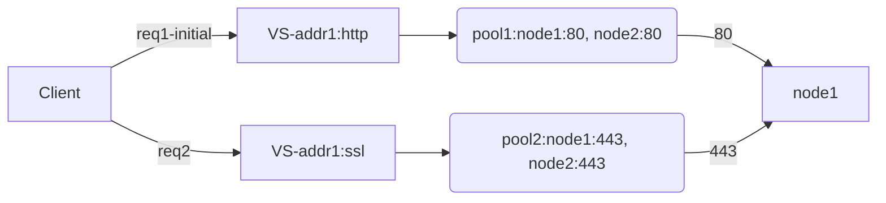
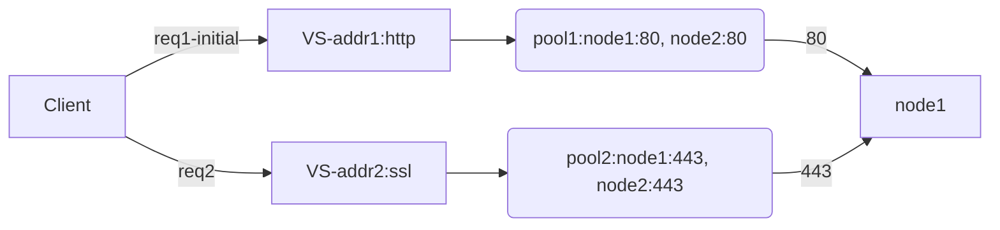
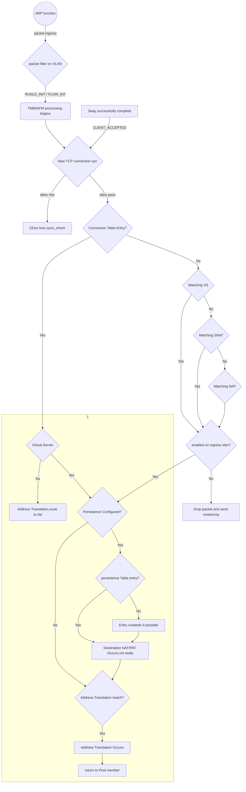

### About
F5 Certified! Technology Specialist, Local Traffic Manager (F5-CTS, LTM)

> v2017 by Edward

> current exam based on version v11.5

> https://mermaidjs.github.io/flowchart.html

> to support flowchart on http://note.youdao.com ,remove "mermaid"

##### Reading List
- BIG-IP® Local Traffic Manager™: Concepts //pdf
- Certification Study Guide 301b //pdf

# Section1:Troubleshoot basic virtual server connectivity issues

## Objective: Profile
- [ ] [Profile Concepts](https://support.f5.com/kb/en-us/products/big-ip_ltm/manuals/product/ltm-concepts-11-2-1/ltm_understanding_profiles.html)

###### Note

> Stream profile: 

    -with HTTP profile    ---> search and replace only on HTTP payload
    -without HTTP profile ---> search and replace on tcp payload
    
> TCP window & buffer:
    
    -max-non-scaled window = 64k
    -proxy buffer high = 131072 (lan-opt:low=98,304 wan-opt:low=131,072)
    
> OneConnect & HTTP:
    
    - SOL6997 / SOL5911 / SOL7208
    -works with keep-alive enabled by default in HTTP/1.1
    -without OneConnect: LB once per tcp connection
    -with OC http/non-http-tcp: ltm is able to proc each request
    -source maskes
    -If SNAT is configured, the BIG-IP system performs SNAT address translation on the source IP address, 
    and then applies the OneConnect source mask to the translated SNAT IP address to determine whether it is eligible to reuse an existing idle connection.
    
> Defferred Accecpt Tcp profile:
    
    -option specifies that the system does not dedicate resources to the connection until the system has received the data packet from the client.
    This setting is useful when negotiating 3-way handshake denial-of-service attacks.
    -disabled by default.
    -not compatible with virtual servers (such as FTP, POP3, and SMTP) for applications that either require *dialog or present a banner*. 
    


## Objective: Upgrade and recovery

> Explain how to upgrade a vCMP environment
    
    -vCMP guest states
        *configured: not runnig,no resource, de-allocate cpu and memery
        *provisioned: allocate resource,create virtual disk
        *deployed: install,run, immediately propagate: hostname,cluster ip, allowed vlans
    
    -dirs:
        /shared/images

> Install sw

    -tmsh install sys software image [image name] volume [volume name]
    -or from web

*A Sync-Failover device group can support a maximum of 15 traffic groups.*

> SCF and UCS files

    -dir: /var/local/scf,/var/local/ucs
    -Beginning in BIG-IP 11.0.0, when installing a UCS configuration archive, the BIG-IP system restores the full configuration.
    -ucs: usrname/passwd,ssl private keys,critical sys files
| -tmsh [load | save] /sys ucs <filename> [no-license | no-private-key] |
| ----------- |on 6400/8400/8800: run /util bash ; keyswap.sh sccp;exit;reboot
    -0107102b:3: Master Key decrypt failure - decrypt failure - final
    

## Objective: Alert
    
> Enterprise Manager:

    -an appliance that helps you streamline the administrative tasks associated with managing multiple network devices.
    -tasks include: performance monitoring, software installation and upgrades, configuration archival and restoration, certificate monitoring, security policy management, software image storage, and user account management.
    -em local&remote events:...
    
> AVR Alerting:

> Remote syslogging:

    creating a pool of servers, 
    creating a custom request logging profile that determines log content and references the log server pool, 
    and then assigning the profile to each virtual server that you create to process application traffic.

>Alert configuration files:
    
    -pre-configured snmp traps: /etc/alertd/alert.conf
    -user-defined SNMP traps: /config/user_alert.conf
    
>log test:
    
    logger -p <facility>.<level> “<alert code>:<log level>: “<Syslog Message String>”


| Log level | Description                      | Corresponding syslog level |
| --------- | -------------------------------- | -------------------------- |
| 0         | System is unusable               | emerg                      |
| 1         | Action must be taken immediately | alert                      |
| 2         | Critical Conditions              | crit                       |
| 3         | Error Conditions                 | err                        |
| 4         | Warning Conditions               | warning                    |
| 5         | Normal but significant condition | notice                     |
| 6         | Informational                    | info                       |
| 7         | Debug-level messages             | debug                      |


# Section2: Identify and resolve application issues

## Objective: iRule

- [ ] [Wiki: iRules API](https://devcentral.f5.com/wiki/iRules.BasicRuleElements.ashx)


> The syntax for the log is:

    -log [<facility>.<level>] <message>
    -facility: “local0”, “local1”, “local2”, “local3”, “local4”, “local5”, “local6”, “local7”
    -level: “alert”, “crit”, “debug”, “emerg”, “err”, “error”, “info”, “none”, “notice”,“panic”, “warn”, “warning”
    -default: “local0” and “error” (local0.)

> AVR:
    
    -avr to trace app traffic
    -create a Analytics profile for vs/app
    
> Browser requirements to obtain page load times

    -Supports Navigation Timing by W3C
    -Accepts cookies from visited application sites
    -Enables JavaScript for the visited application sites

## Objective: HTTP/HTTPS

> Response Code

    1xx: Informational - Request received, continuing process
    
    2xx: Success - The action was successfully received, understood, and accepted
    
    3xx: Redirection - Further action must be taken in order to complete the request
    
    4xx: Client Error - The request contains bad syntax or cannot be fulfilled
    
    5xx: Server Error - The server failed to fulfill an apparently valid request

> HTTP Method
    
    GET / HEAD / POST / TRACE / PUT / DELETE HEAD

> HTTP HEADERS

    1. HTTP version (HTTP/1.0 or HTTP/1.1)
    
    2. Accept-Encoding: gzip, deflate (not include in 1.0 by default)
    
    3. Connection: Keep-Alive (not include in 1.0 by default)
    
    4. If-* headers
    
    5. Cache-Control or Pragma no-cache


```
GET /home.html HTTP/1.1
Host: example1.org

If the URL references a port other than the default (TCP port 80), this is also given in the Host header.
Clearly, since HTTP/1.0 clients will not send Host headers, HTTP/1.1 servers cannot simply reject all
messages without them. However, the HTTP/1.1 specification requires that an HTTP/1.1 server must reject
any HTTP/1.1 message that does not contain a Host header.
```

> ssldump utility

[packet trace with ssldump](https://support.f5.com/csp/article/K10209)

```
//To create a pre-master secret key log file, use the following ssldump syntax:

ssldump -r /path/to/capture_file -k /path/to/private_key -M /path/to/premaster-
key_log_file

//For example, the following ssldump command reads the www-ssl-client1.cap capture file using the test. org key file to decrypt the session, 
and creates the PMS log file called client1.pms:

ssldump -r /var/tmp/www-ssl-client1.cap -k /config/filestore/files_d/Common_d/
certificate_key_d/\:Common\:test.org.key_1 -M /var/tmp/client1.pms


To print the decrypted application data, 
use the -k option to specify the path and name of the file
containing the server’s private key.

For example:
ssldump -Aed -nr /var/tmp/www-ssl-client.cap -k /config/ssl/ssl.key/www-ssl.key

Note: In BIG-IP 11.x, the SSL profile keys are stored in the /config/filestore/files_d/<partition_name>_d/certificate_key_d/ directory.
```

> Http Chunking

[http chunking overview](https://support.f5.com/csp/article/K5379)
    
    Some operations involve modifying content, such as adding content using an iRule, or applying compression.
    These operations need to first remove chunking (unchunk), perform the operation, and optionally reapply chunking (rechunk) to the new content.
    
    unchunck / rechunk / selective / preserve
    

> Persistence Profiles 

```
The persistence types that you can enable using a persistence profile are:

• Cookie persistence
Cookie persistence uses an HTTP cookie stored on a client’s computer to allow the client to reconnect
to the same server previously visited at a web site.

• Destination address affinity persistence
Also known as sticky persistence, destination address affinity persistence supports TCP and UDP
protocols, and directs session requests to the same server based solely on the destination IP address
of a packet.

• Hash persistence
Hash persistence allows you to create a persistence hash based on an existing iRule.
• Microsoft Remote Desktop Protocol persistence
Microsoft Remote Desktop Protocol (MSRDP) persistence tracks sessions between clients and servers
running the Microsoft Remote Desktop Protocol (RDP) service.

• SIP persistence
SIP persistence is a type of persistence used for servers that receive Session Initiation Protocol (SIP)
messages sent through UDP, SCTP, or TCP.

• Source address affinity persistence
Also known as simple persistence, source address affinity persistence supports TCP and UDP
protocols, and directs session requests to the same server based solely on the source IP address
of a packet.

• SSL persistence
SSL persistence is a type of persistence that tracks non-terminated SSL sessions, using the SSL
session ID. Even when the clients IP address changes, Local Traffic Manager still recognizes the
connection as being persistent based on the session ID. Note that the term non-terminated SSL
sessions refers to sessions in which Local Traffic Manager does not perform the tasks of SSL
certificate authentication and encryption/re-encryption.

• Universal persistence
Universal persistence allows you to write an expression that defines what to persist on in a packet.
The expression, written using the same expression syntax that you use in iRules, defines some
sequence of bytes to use as a session identifier.
```

> OneConnect profile and session persistence
pass

> Match Across Services setting



In order for the Match Across Services setting to be effective, 
virtual servers that use the **same virtual address**, as well as those that use SSL persistence,
should include the **same node addresses** in the virtual server mappings. 

apply to cookied hash only

> Match Across Virtual Servers setting


In order for this setting to be effective, virtual servers that use pools with TCP or SSL
persistence should include the **same member addresses** in the virtual server mappings.

apply to cookied hash only

> Match Across Pools setting

When you enable the Match Across Pools setting, Local Traffic Manager can use any pool that contains a
given persistence record. The default is disabled (cleared).

Enabling this setting can cause Local Traffic Manager to direct client traffic to a pool other
than that specified by the virtual server.

apply to cookied hash only

> Tcpdump & ssldump

[K13637: Capturing internal TMM information with tcpdump](https://support.f5.com/csp/article/K13637)

[K411](https://support.f5.com/csp/article/K411)

```
tcpdump -s0 -ni /partition/<vlan>:<noiseamplitude> -w <path to output file> <filter options>

For example:

tcpdump -s0 -ni internal:nnn -w /var/tmp/my_output_file.dmp

The tcpdump utility does not capture traffic when run from a non-default route domain:
rdsh 0
```

> Tcpdump & snat

Starting in v11.2, there is an undocumented feature that can help. It’s a new “-p” flag to
dump on “peer” flows in tcpdump.
tcpdump -ni 0.0:nnnp -s 0 host client-ip -w /var/tmp/traffic_from_client.pcap

> [K9812: Overview of BIG-IP TCP RST behavior](https://support.f5.com/csp/article/K9812?sr=46608010)

##### Global settings

Adaptive Reaping

To prevent SYN flood attacks, and to preserve memory, the BIG-IP system can prevent new connections by sending a TCP RST packet to the client when memory usage increases beyond the reaper high-water mark setting. The TCP RST packet is sent on the client side of the connection, and the source IP address of the reset is the relevant BIG-IP LTM object IP address for which the SYN request was destined.

Note: For more information, refer to K5670: Overview of adaptive connection reaping (11.5.x and earlier) and K14813: Detecting and mitigating DoS/DDoS attacks (11.4.x - 12.x).

TM.RejectUnmatched

By default, the TM.RejectUnmatched BigDB variable is set to true, and the BIG-IP system sends a TCP RST packet in response to a non-SYN packet that matches a virtual server address and port or self IP address and port, but does not match an established connection. The BIG-IP system also sends a TCP RST packet in response to a packet that matches a virtual server address, or self IP address, but specifies an invalid port. The TCP RST packet is sent on the client side of the connection, and the source IP address of the reset is the relevant BIG-IP LTM object address or self IP address for which the packet was destined. If TM.RejectUnmatched is set to false, the system silently drops unmatched packets.

TM.MaxRejectRate

The TM.MaxRejectRate BigDB variable can reduce the effects of a denial-of-service (DoS) attack by allowing you to limit the number of TCP RSTs or ICMP unreachable packets that the BIG-IP system sends in response to incoming connections that cannot be matched with virtual server connections. The default value for the TM.MaxRejectRate db key is 250 TCP RSTs or 250 ICMP unreachable packets, per second.

Note: For more information, refer to K13151: Configuring the rate at which the BIG-IP system issues TCP RSTs or ICMP unreachable packets (11.x - 13.x).


> CMP

Even if CMP is enabled on a virtual server, the BIG-IP system demotes a virtual server with incompatible
features from CMP processing. This means it will run slower due to the CMP feature being turned off.
If the virtual server has been demoted, the CMP Mode line of the TMSH show ltm virtual <virtual_server_
name> command reports none, disable, or single to indicate that CMP has been demoted for the virtual
server.

> Extended Application Verification Monitor (EVA)

An EAV monitor is an executable script located on the BIG-IP’s file system (usually under /usr/bin/monitors)
that is executed at regular intervals by the bigd daemon and reports its status.

*Any output to stdout (standard output) from the script will mark the pool member “up”.*

```
#!/bin/bash

# $1 = node IP
# $2 = node port
# $3 = hostname to resolve

[[ $# != 3 ]] && logger -p local0.error -t ${0##*/} -- "usage: ${0##*/} <node IP> <node port> <hostname to resolve>" && exit 1

node_ip=$(echo $1 | sed 's/::ffff://')

dig +short @$node_ip $3 IN A &> /dev/null

[[ $? == 0 ]] && echo “UP”
```


# Section3: Identify and resolve LTM device issues

[K14800: Order of precedence for virtual server matching](https://support.f5.com/csp/article/K14800)
```
Destination address
Source address
Service port
```

> 01010029:5: Clock advanced by <number> ticks

If the error message is logged continually, the system is likely experiencing resource issues that may be
caused by one or more of the following factors:

- Memory paging, I/O operations, or other events causing TMM to lose CPU time
- Complex iRule configurations
- Large complex configurations, such as those containing numerous Secure Socket Layer (SSL) profiles with
- SSL certificates or keys
- Certain administrative operations, such as dumping large numbers of connections or persistence entries
- Listing large ARP tables using commands such as TMSH show net arp

refer to SOL10472: Intense disk drive I/O
activity may cause essential BIG-IP processes to be swapped out or descheduled.


> Issues that may cause network failover problems

- Busy or blocked TMM daemon : 01010029:5: Clock advanced by <number> ticks
    
    To limit network failover disruptions related to the previous scenario, implement one or more of the following
options:
    
    - Configure redundant network failover channels (use the management network, in addition to a TMM
network)
    - Configure hardwired failover (appliance platforms)
    - Add additional failover unicast addresses for device group members
    - Increase the network failover timeout

- VIPRION blade failure
- Failover events causing VLAN disruption

To Workround:
  
    Configure network failover for VIPRION systems  
    Configure redundant network failover channels (use the management network, in addition to a TMM network)
    Configure hardwired failover (appliance platforms)
    Add additional failover unicast addresses for device group members
    Increase the network failover timeout
    Configure gateway failsafe ？

> Port Lock

```
UDP 1026 network failover

modify /net self <self_ip> allow-service <option>
modify /net self 10.10.10.1 allow-service default
```

> When configuring VLAN failsafe for a VLAN, you should consider the following factors:

• VLAN failsafe configuration is local to the BIG-IP system and is not a shared configuration that is
synchronized between high-availability systems during ConfigSync operations. As a result, you must
define VLAN failsafe on all BIG-IP units in a high-availability system.

• To avoid unnecessary failover, the VLAN failsafe timeout value should be set to a value larger than the
number of seconds that the neighboring links take to initialize. An unnecessary failover may cause
more disruption than a brief flap in network connectivity. Setting the timeout too low can cause system
and network instability issues if both members of the redundant system experience intermittent
connectivity.

• If you enable VLAN failsafe on a VLAN with nodes that do not respond consistently to the standard
VLAN failsafe probes, the BIG-IP high-availability systems can experience unintended VLAN failsafe
events.

• Unwanted VLAN failsafe events can occur if VLAN failsafe is enabled on a VLAN with no default
gateway or pool members, and the VLAN contains only devices that do not respond to ARP requests,
ICMPv6 neighbor discovery probes, or multicast pings. To help prevent this behavior, you can assign a
health monitor to at least one node on that VLAN. This practice helps to consistently populate the ARP
tables on the BIG-IP high-availability systems, and give a more accurate view of VLAN availability.
F5 STUDY GUIDE 301b – BIG-IP LTM Technology Specialist: Maintain and Troubleshoot
184

• If you set the VLAN failsafe action to Restart All or Reboot when a low failsafe timeout value is
configured, the BIG-IP system may enter a cycle of restarting services or rebooting until VLAN failsafe
is disabled. This behavior may occur when the timeout value is set too low and the interfaces are not
available after a reboot or restart due to a Spanning Tree update or because LACP enabled trunks
have not initialized. To prevent this behavior from occurring, do not set the VLAN failsafe timeout value
below the recommended value of 90 seconds.

• Testing the VLAN failsafe feature for an HA redundant pair by removing all nodes from the VLAN may
not result in a VLAN failsafe action being triggered. If the VLAN being tested is used for network failover
and/or state mirroring, the traffic generated between the redundant BIG-IP systems is sufficient to
prevent VLAN failsafe from being triggered.


> serial and network failover

Network failover is based on heartbeat detection where the system sends heartbeat packets over the internal
network.

Hardwired failover is also based on heartbeat detection, where one BIG-IP system continuously sends voltage
to another. If a response does not initiate from one BIG-IP system, failover to the peer occurs in less than one
second. When BIG-IP redundant devices connect using a hardwired failover cable, the system automatically
enables hardwired failover.

The maximum hardwired cable length is 50 feet. Network failover is an option if the distance between two
BIG-IP systems exceeds the acceptable length for a hardwired failover cable.


Certain statistical output may reflect that *the active unit was not receiving any traffic on a VLAN* and when you
notice in the logs that a fail over occurred you may attribute it to the VLAN failsafe setting in your configuration.
The following is an example of errors you may see in the log if VLAN failsafe triggered:
```
01140029:5: HA vlan_fs vlan1 fails action is reboot.
01140029:5: HA vlan_fs vlan2 fails action is reboot.
```

> ConfigSync Failures

F5 introduced the Device Service Cluster (DSC) architecture in BIG-IP 11.x. DSC provides the framework for
ConfigSync, and other high-availability features, such as failover for BIG-IP device groups.

CMI: centralized management infrastructure (CMI).

CMI communication channel: the BIG-IP device signs x509 certificates for another BIG-IP
device that is in the local trust domain.

```
/config/ssl/ssl.crt/dtdi.crt
The dtdi.crt is the identity certificate that is
used by a device to validate its identity with
another device.
/config/ssl/ssl.key/dtdi.key
The dtdi.key is the corresponding key file
used by a device to validate its identity with
another device.

/config/ssl/ssl.crt/dtca.crt
The dtca.crt is the CA root certificate for
the trust network.
/config/ssl/ssl.key/dtca.key
The dtca.crt is the CA root key for the
trust network.
```

configsync-->>mcpd--->(6699)tmm(4353)----cmi channel----tmm(6699)--->mcpd--->>configsync

> To display the commit ID and the commit ID time stamps for the device group
```
BIG-IP 11.0.0 through 11.2.0:
watch_devicegroup_device

devices <devgroup [device cid.id cid.orig cid.time last_sync
20 21 sync_test bigip_a 32731 bigip_a.pslab.local 14:27:00 : :
20 21 sync_test bigip_b 1745 bigip_a.pslab.local 13:39:24 13:42:04
20 21 sync_test bigip_c 1745 bigip_a.pslab.local 13:39:24 13:42:04
```


> Packet flow in LTM



