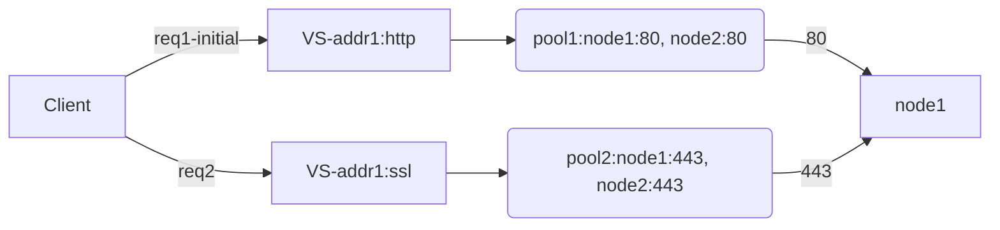

### About
F5 Certified! Technology Specialist, Local Traffic Manager (F5-CTS, LTM)

> v2017 by Edward

> current exam based on version v11.5

> https://mermaidjs.github.io/flowchart.html

> to support flowchart on http://note.youdao.com ,remove "mermaid"

##### Reading List
- BIG-IP® Local Traffic Manager™: Concepts //pdf
- Certification Study Guide 301b //pdf

# Section1:Troubleshoot basic virtual server connectivity issues

## Objective: Profile
- [ ] [Profile Concepts](https://support.f5.com/kb/en-us/products/big-ip_ltm/manuals/product/ltm-concepts-11-2-1/ltm_understanding_profiles.html)

###### Note

> Stream profile: 

    -with HTTP profile    ---> search and replace only on HTTP payload
    -without HTTP profile ---> search and replace on tcp payload
    
> TCP window & buffer:
    
    -max-non-scaled window = 64k
    -proxy buffer high = 131072 (lan-opt:low=98,304 wan-opt:low=131,072)
    
> OneConnect & HTTP:
    
    - SOL6997 / SOL5911 / SOL7208
    -works with keep-alive enabled by default in HTTP/1.1
    -without OneConnect: LB once per tcp connection
    -with OC http/non-http-tcp: ltm is able to proc each request
    -source maskes
    -If SNAT is configured, the BIG-IP system performs SNAT address translation on the source IP address, 
    and then applies the OneConnect source mask to the translated SNAT IP address to determine whether it is eligible to reuse an existing idle connection.
    
> Defferred Accecpt Tcp profile:
    
    -option specifies that the system does not dedicate resources to the connection until the system has received the data packet from the client.
    This setting is useful when negotiating 3-way handshake denial-of-service attacks.
    -disabled by default.
    -not compatible with virtual servers (such as FTP, POP3, and SMTP) for applications that either require *dialog or present a banner*. 
    


###### Q&A
>todo


## Objective: Upgrade and recovery

> Explain how to upgrade a vCMP environment
    
    -vCMP guest states
        *configured: not runnig,no resource, de-allocate cpu and memery
        *provisioned: allocate resource,create virtual disk
        *deployed: install,run, immediately propagate: hostname,cluster ip, allowed vlans
    
    -dirs:
        /shared/images

> Install sw

    -tmsh install sys software image [image name] volume [volume name]
    -or from web

*A Sync-Failover device group can support a maximum of 15 traffic groups.*

> SCF and UCS files

    -dir: /var/local/scf,/var/local/ucs
    -Beginning in BIG-IP 11.0.0, when installing a UCS configuration archive, the BIG-IP system restores the full configuration.
    -ucs: usrname/passwd,ssl private keys,critical sys files
| -tmsh [load | save] /sys ucs <filename> [no-license | no-private-key] |
| ----------- |on 6400/8400/8800: run /util bash ; keyswap.sh sccp;exit;reboot
    -0107102b:3: Master Key decrypt failure - decrypt failure - final
    
###### Q&A
>todo


## Objective: Alert
    
> Enterprise Manager:

    -an appliance that helps you streamline the administrative tasks associated with managing multiple network devices.
    -tasks include: performance monitoring, software installation and upgrades, configuration archival and restoration, certificate monitoring, security policy management, software image storage, and user account management.
    -em local&remote events:...
    
> AVR Alerting:

> Remote syslogging:

    creating a pool of servers, 
    creating a custom request logging profile that determines log content and references the log server pool, 
    and then assigning the profile to each virtual server that you create to process application traffic.

>Alert configuration files:
    
    -pre-configured snmp traps: /etc/alertd/alert.conf
    -user-defined SNMP traps: /config/user_alert.conf
    
>log test:
    
    logger -p <facility>.<level> “<alert code>:<log level>: “<Syslog Message String>”


| Log level | Description                      | Corresponding syslog level |
| --------- | -------------------------------- | -------------------------- |
| 0         | System is unusable               | emerg                      |
| 1         | Action must be taken immediately | alert                      |
| 2         | Critical Conditions              | crit                       |
| 3         | Error Conditions                 | err                        |
| 4         | Warning Conditions               | warning                    |
| 5         | Normal but significant condition | notice                     |
| 6         | Informational                    | info                       |
| 7         | Debug-level messages             | debug                      |

###### QA


# Section2: Identify and resolve application issues

## Objective: iRule

- [ ] [Wiki: iRules API](https://devcentral.f5.com/wiki/iRules.BasicRuleElements.ashx)


> The syntax for the log is:

    -log [<facility>.<level>] <message>
    -facility: “local0”, “local1”, “local2”, “local3”, “local4”, “local5”, “local6”, “local7”
    -level: “alert”, “crit”, “debug”, “emerg”, “err”, “error”, “info”, “none”, “notice”,“panic”, “warn”, “warning”
    -default: “local0” and “error” (local0.)

> AVR:
    
    -avr to trace app traffic
    -create a Analytics profile for vs/app
    
> Browser requirements to obtain page load times

    -Supports Navigation Timing by W3C
    -Accepts cookies from visited application sites
    -Enables JavaScript for the visited application sites

## Objective: HTTP/HTTPS

> Response Code

    1xx: Informational - Request received, continuing process
    
    2xx: Success - The action was successfully received, understood, and accepted
    
    3xx: Redirection - Further action must be taken in order to complete the request
    
    4xx: Client Error - The request contains bad syntax or cannot be fulfilled
    
    5xx: Server Error - The server failed to fulfill an apparently valid request

> HTTP Method
    
    GET / HEAD / POST / TRACE / PUT / DELETE HEAD

> HTTP HEADERS

    1. HTTP version (HTTP/1.0 or HTTP/1.1)
    
    2. Accept-Encoding: gzip, deflate (not include in 1.0 by default)
    
    3. Connection: Keep-Alive (not include in 1.0 by default)
    
    4. If-* headers
    
    5. Cache-Control or Pragma no-cache


```
GET /home.html HTTP/1.1
Host: example1.org

If the URL references a port other than the default (TCP port 80), this is also given in the Host header.
Clearly, since HTTP/1.0 clients will not send Host headers, HTTP/1.1 servers cannot simply reject all
messages without them. However, the HTTP/1.1 specification requires that an HTTP/1.1 server must reject
any HTTP/1.1 message that does not contain a Host header.
```

> ssldump utility

[packet trace with ssldump](https://support.f5.com/csp/article/K10209)

```
//To create a pre-master secret key log file, use the following ssldump syntax:

ssldump -r /path/to/capture_file -k /path/to/private_key -M /path/to/premaster-
key_log_file

//For example, the following ssldump command reads the www-ssl-client1.cap capture file using the test. org key file to decrypt the session, 
and creates the PMS log file called client1.pms:

ssldump -r /var/tmp/www-ssl-client1.cap -k /config/filestore/files_d/Common_d/
certificate_key_d/\:Common\:test.org.key_1 -M /var/tmp/client1.pms


To print the decrypted application data, 
use the -k option to specify the path and name of the file
containing the server’s private key.

For example:
ssldump -Aed -nr /var/tmp/www-ssl-client.cap -k /config/ssl/ssl.key/www-ssl.key

Note: In BIG-IP 11.x, the SSL profile keys are stored in the /config/filestore/files_d/<partition_name>_d/certificate_key_d/ directory.
```

> Http Chunking

[http chunking overview](https://support.f5.com/csp/article/K5379)
    
    Some operations involve modifying content, such as adding content using an iRule, or applying compression.
    These operations need to first remove chunking (unchunk), perform the operation, and optionally reapply chunking (rechunk) to the new content.
    
    unchunck / rechunk / selective / preserve
    

> Persistence Profiles 

```
The persistence types that you can enable using a persistence profile are:

• Cookie persistence
Cookie persistence uses an HTTP cookie stored on a client’s computer to allow the client to reconnect
to the same server previously visited at a web site.

• Destination address affinity persistence
Also known as sticky persistence, destination address affinity persistence supports TCP and UDP
protocols, and directs session requests to the same server based solely on the destination IP address
of a packet.

• Hash persistence
Hash persistence allows you to create a persistence hash based on an existing iRule.
• Microsoft Remote Desktop Protocol persistence
Microsoft Remote Desktop Protocol (MSRDP) persistence tracks sessions between clients and servers
running the Microsoft Remote Desktop Protocol (RDP) service.

• SIP persistence
SIP persistence is a type of persistence used for servers that receive Session Initiation Protocol (SIP)
messages sent through UDP, SCTP, or TCP.

• Source address affinity persistence
Also known as simple persistence, source address affinity persistence supports TCP and UDP
protocols, and directs session requests to the same server based solely on the source IP address
of a packet.

• SSL persistence
SSL persistence is a type of persistence that tracks non-terminated SSL sessions, using the SSL
session ID. Even when the clients IP address changes, Local Traffic Manager still recognizes the
connection as being persistent based on the session ID. Note that the term non-terminated SSL
sessions refers to sessions in which Local Traffic Manager does not perform the tasks of SSL
certificate authentication and encryption/re-encryption.

• Universal persistence
Universal persistence allows you to write an expression that defines what to persist on in a packet.
The expression, written using the same expression syntax that you use in iRules, defines some
sequence of bytes to use as a session identifier.
```

> OneConnect profile and session persistence
pass

> Match Across Services setting



In order for the Match Across Services setting to be effective, virtual servers that use
the same virtual address, as well as those that use SSL persistence, should include the same node
addresses in the virtual server mappings. 

apply to cookied hash only

> Match Across Virtual Servers setting

apply to cookied hash only

> Match Across Pools setting

apply to cookied hash only


>

# Section3: Identify and resolve LTM device issues

